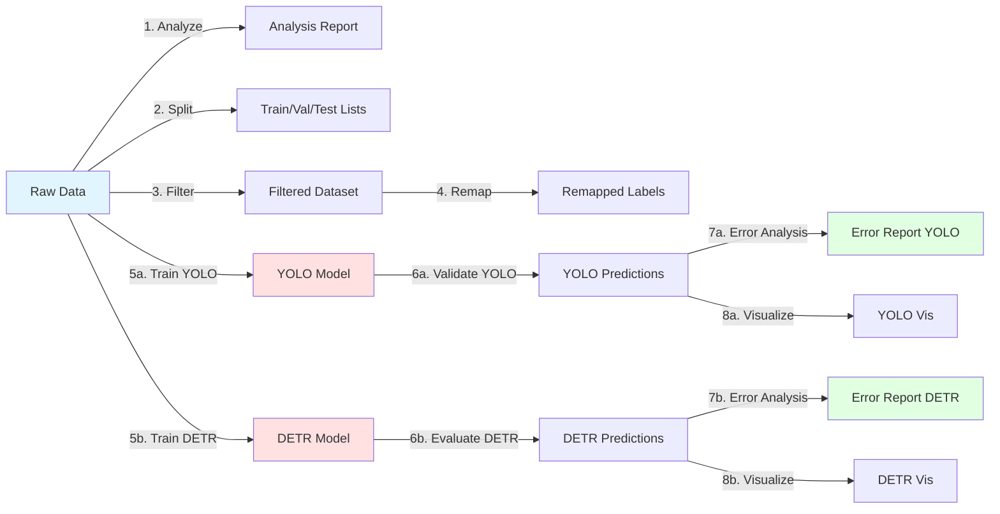

# KLGrade - Knee Osteoarthritis Detection

**Object detection cho phân loại và phát hiện tổn thương xương khớp gối từ hình ảnh X-quang**

## 📋 Tổng quan

Project sử dụng deep learning để phát hiện và phân loại các mức độ tổn thương xương khớp gối (KL grades 0-4) từ ảnh X-quang. Hỗ trợ 2 kiến trúc:

- **YOLO11** (YOLOv11) - Real-time detection
- **DETR** (Detection Transformer) - Transformer-based detection

---

## 🚀 Workflow Tổng Quát

### Kiến trúc Modular - Plug-and-Play

**Mỗi bước hoàn toàn độc lập**, chỉ cần input/output file paths. Bạn có thể:

- ✅ Chạy bất kỳ bước nào mà không cần chạy bước trước
- ✅ Thay thế bất kỳ module nào (ví dụ: dùng data augmentation khác)
- ✅ Bỏ qua các bước không cần thiết
- ✅ Chạy song song nhiều experiments



### Pipeline Stages (Tất cả độc lập)

| Stage                 | Input                | Output                             | Script                              | Có thể bỏ qua? |
| --------------------- | -------------------- | ---------------------------------- | ----------------------------------- | -------------- |
| **1. Analyze**        | Images + Labels      | `analysis.txt`                     | `check_dataset/analyze_dataset.py`  | ✅ Optional    |
| **2. Split**          | Images + Labels      | `train.txt`, `val.txt`, `test.txt` | `split_dataset.py`                  | ❌ Required    |
| **3. Filter**         | Dataset              | Filtered dataset                   | `filter_dataset_by_class.py`        | ✅ Optional    |
| **4. Remap**          | Labels               | Remapped labels                    | `remap_filtered_labels.py`          | ✅ Optional    |
| **5. Train**          | Images + Labels      | Model `.pt`                        | `examples/train_*.py`               | ❌ Required    |
| **6. Evaluate**       | Model + Images       | `predictions.json` + metrics       | `examples/evaluate_*.py`            | ✅ Optional    |
| **7. Error Analysis** | Predictions + GT     | Error reports                      | `examples/error_analysis.py`        | ✅ Optional    |
| **8. Visualize**      | Predictions + Images | Visualization images               | `examples/visualize_predictions.py` | ✅ Optional    |

---

## 📦 Cài đặt

### Yêu cầu

- Python 3.10+
- CUDA-capable GPU (khuyến nghị)
- 8GB+ RAM

### Setup Environment

```powershell
# 1. Clone repository
git clone <repo-url>
cd KLGrade

# 2. Tạo virtual environment
python -m venv .venv
.venv\Scripts\activate

# 3. Cài đặt dependencies
pip install -r requirements.txt
```

**Chi tiết dependencies**: Xem [DEPENDENCIES.md](DEPENDENCIES.md)

---

## 📂 Cấu trúc Project

```
KLGrade/
├── dataset/                    # Raw data
│   └── dataset_v1/
│       ├── images/            # Ảnh X-quang (.jpg)
│       ├── labels/            # YOLO labels (5 classes)
│       └── labels_new/        # YOLO labels (10 classes)
│
├── splits/                     # Train/val/test splits
│   ├── train.txt
│   ├── val.txt
│   └── test.txt
│
├── processed/                  # Processed data
│   ├── coco/                  # COCO format annotations
│   └── yolo11_labels.yaml     # YOLO config
│
├── examples/                   # Training & evaluation scripts
│   ├── train_yolo11.py
│   ├── train_detr.py
│   ├── evaluate_detr.py
│   ├── validate_yolo.py
│   ├── error_analysis.py
│   └── visualize_predictions.py
│
├── datasets/                   # Dataset modules
│   ├── coco_dataset.py
│   ├── converters.py
│   └── detr_transforms.py
│
├── check_dataset/             # Data validation tools
│   ├── analyze_dataset.py
│   ├── visualize_yolo_boxes.py
│   └── class_split_report.py
│
├── runs/                      # Training outputs
│   ├── detect/                # YOLO runs
│   └── detr/                  # DETR runs
│
├── config.py                  # Cấu hình classes
├── split_dataset.py           # Split train/val/test
├── filter_dataset_by_class.py # Filter classes
├── remap_filtered_labels.py   # Remap class IDs
└── requirements.txt           # Dependencies
```

---

## 🔄 Workflow Chi Tiết - Từng Bước

### **BƯỚC 1: Phân tích Dataset Ban Đầu**

#### 1.1. Kiểm tra dữ liệu thô

**Input**: `dataset/dataset_v1/images/` + `dataset/dataset_v1/labels/`

```powershell
# Phân tích phân bố classes, số lượng samples
.venv\Scripts\python.exe check_dataset\analyze_dataset.py `
    --image_dir dataset/dataset_v1/images `
    --label_dir dataset/dataset_v1/labels `
    --output analysis_results.txt
```

**Output**: Báo cáo thống kê

- Tổng số ảnh
- Số lượng samples mỗi class
- Phân bố bounding boxes
- Class imbalance

#### 1.2. Visualize annotations

```powershell
# Kiểm tra chất lượng labels bằng visualization
.venv\Scripts\python.exe check_dataset\visualize_yolo_boxes.py `
    --image_dir dataset/dataset_v1/images `
    --label_dir dataset/dataset_v1/labels `
    --output check_vis `
    --num_samples 20
```

**Output**: `check_vis/` - Ảnh với bounding boxes vẽ lên

---

### **BƯỚC 2: Chia Dataset (Train/Val/Test)**

#### 2.1. Stratified split

**Input**: Raw images + labels  
**Output**: `splits/train.txt`, `splits/val.txt`, `splits/test.txt`

```powershell
# Split với tỷ lệ 70:20:10, stratified theo class
.venv\Scripts\python.exe split_dataset.py `
    --image_dir dataset/dataset_v1/images `
    --label_dir dataset/dataset_v1/labels `
    --output_dir splits `
    --train_ratio 0.7 `
    --val_ratio 0.2 `
    --test_ratio 0.1 `
    --seed 42
```

#### 2.2. Tạo báo cáo phân bố

```powershell
# Kiểm tra phân bố classes sau khi split
.venv\Scripts\python.exe check_dataset\class_split_report.py `
    --label_dir dataset/dataset_v1/labels `
    --splits_dir splits
```

**Output**: Báo cáo phân bố classes ở từng split

---

### **BƯỚC 3: Filter & Remap Classes (Tùy chọn)**

#### 3.1. Filter dataset theo classes

**Use case**: Loại bỏ rare classes hoặc tạo subset

```powershell
# Ví dụ: Chỉ giữ lại KL-0,1,2,3,4 (5 classes chính)
.venv\Scripts\python.exe filter_dataset_by_class.py `
    --input_dir dataset/dataset_v1 `
    --output_dir dataset/dataset_filtered `
    --classes_to_keep 0,1,2,3,4
```

**Output**: `dataset/dataset_filtered/` với chỉ các classes được chọn

#### 3.2. Remap class IDs

**Use case**: Đảm bảo class IDs liên tục (0, 1, 2, 3, 4) sau khi filter

```powershell
# Remap class IDs về dạng liên tục
.venv\Scripts\python.exe remap_filtered_labels.py `
    --label_dir dataset/dataset_filtered/labels `
    --output_dir dataset/dataset_filtered/labels_remapped
```

---

### **BƯỚC 4: Chuẩn bị Input cho Models**

#### 4.1. YOLO Format (Đã có sẵn)

**Format**: YOLO txt files

```
# Mỗi dòng: <class_id> <x_center> <y_center> <width> <height> (normalized 0-1)
0 0.5 0.5 0.2 0.3
1 0.3 0.4 0.15 0.25
```

**Config file**: `processed/yolo11_labels.yaml`

```yaml
path: e:/CaoHoc/thesis/KLGrade
train: dataset/dataset_v1/images
val: dataset/dataset_v1/images

names:
  0: KL0
  1: KL1
  2: KL2
  3: KL3
  4: KL4
```

#### 4.2. COCO Format (Tự động convert khi train DETR)

**Format**: JSON với `images`, `annotations`, `categories`

Training script tự động convert YOLO → COCO bằng `datasets.create_coco_json()`

**Output**: `processed/coco/annotations_train.json`, `annotations_val.json`

---

### **BƯỚC 5: Training Models**

#### 5.1. Training YOLO11

**Script**: `examples/train_yolo11.py`

```powershell
# Baseline - 5 classes
.venv\Scripts\python.exe examples\train_yolo11.py `
    --data processed/yolo11_labels.yaml `
    --model yolo11n.pt `
    --epochs 100 `
    --batch 16 `
    --imgsz 640 `
    --name exp_baseline_5classes
```

**Tham số chính**:

- `--model`: `yolo11n.pt` (nano), `yolo11s.pt` (small), `yolo11m.pt` (medium)
- `--epochs`: Số lượng epochs (khuyến nghị 50-100)
- `--batch`: Batch size (tùy GPU: 8, 16, 32)
- `--imgsz`: Kích thước ảnh input (640, 800, 1024)

**Xem thêm commands**: [TRAINING_COMMANDS.ps1](TRAINING_COMMANDS.ps1)

#### 5.2. Training DETR

**Script**: `examples/train_detr.py`

```powershell
# Baseline - ResNet-50 backbone
.venv\Scripts\python.exe examples\train_detr.py `
    --img_dir dataset/dataset_v1/images `
    --label_dir dataset/dataset_v1/labels `
    --model facebook/detr-resnet-50 `
    --epochs 100 `
    --batch 4 `
    --lr 1e-4 `
    --output runs/detr/exp_baseline
```

**Tham số chính**:

- `--model`: `facebook/detr-resnet-50`, `facebook/detr-resnet-101`
- `--epochs`: Số lượng epochs (khuyến nghị 50-100)
- `--batch`: Batch size (2-8 tùy GPU)
- `--lr`: Learning rate (1e-4, 5e-5)
- `--use_labels_new`: Dùng 10 classes thay vì 5

**Xem thêm commands**: [TRAINING_DETR_COMMANDS.ps1](TRAINING_DETR_COMMANDS.ps1)

---

### **BƯỚC 6: Evaluation & Metrics**

#### 6.1. YOLO Evaluation (Tự động)

YOLO tự động evaluate trong quá trình training và lưu metrics:

**Output**: `runs/detect/<exp_name>/`

- `results.csv` - Metrics theo epoch (mAP, precision, recall)
- `results.png` - Biểu đồ metrics
- `confusion_matrix.png` - Ma trận nhầm lẫn
- `val_batch*_pred.jpg` - Visualization

**Evaluation riêng**:

```powershell
.venv\Scripts\python.exe examples\validate_yolo.py `
    --model runs/detect/exp_baseline/weights/best.pt `
    --data processed/yolo11_labels.yaml `
    --conf 0.25 `
    --output runs/detect/exp_baseline/validation
```

#### 6.2. DETR Evaluation

**Script**: `examples/evaluate_detr.py`

```powershell
.venv\Scripts\python.exe examples\evaluate_detr.py `
    --model_path runs/detr/exp_baseline/best_model.pt `
    --img_dir dataset/dataset_v1/images `
    --label_dir dataset/dataset_v1/labels `
    --conf_threshold 0.01 `
    --output runs/detr/exp_baseline/evaluation
```

**Output**: `runs/detr/<exp_name>/evaluation/`

- `metrics.json` - COCO metrics (mAP50, mAP50-95, AR)
- `results.txt` - Báo cáo metrics dễ đọc
- `predictions.json` - Predictions ở COCO format

**Metrics chính**:

- **mAP50-95**: Mean AP @ IoU 0.5:0.95 (metric chính)
- **mAP50**: Mean AP @ IoU 0.5
- **mAP75**: Mean AP @ IoU 0.75
- **AR@100**: Average Recall với max 100 detections
- **Per-class metrics**: mAP cho từng class

---

### **BƯỚC 7: Error Analysis & Visualization**

#### 7.1. Phân tích lỗi chi tiết

**Script**: `examples/error_analysis.py`

```powershell
# Phân tích DETR
.venv\Scripts\python.exe examples\error_analysis.py `
    --predictions runs/detr/exp_baseline/evaluation/predictions.json `
    --ground_truth processed/coco/annotations_val.json `
    --output runs/detr/exp_baseline/error_analysis

# Phân tích YOLO
.venv\Scripts\python.exe examples\error_analysis.py `
    --predictions runs/detect/exp_baseline/validation/val/predictions.json `
    --ground_truth processed/coco/annotations_val.json `
    --output runs/detect/exp_baseline/error_analysis
```

**Output**:

- `error_analysis.csv` - Chi tiết per-image và per-class
  - True Positives (TP)
  - False Positives (FP)
  - False Negatives (FN - bỏ sót)
  - Classification Errors (nhầm class)
  - Precision, Recall, F1-Score
- `error_report.txt` - Báo cáo dễ đọc
  - Tỉ lệ sai/thiếu/chênh lệch
  - Confusion matrix
  - Error breakdown
- `statistics.json` - Dữ liệu thô cho phân tích sâu

#### 7.2. Visualization

**Script**: `examples/visualize_predictions.py`

```powershell
# Vẽ predictions lên ảnh (side-by-side với ground truth)
.venv\Scripts\python.exe examples\visualize_predictions.py `
    --predictions runs/detr/exp_baseline/evaluation/predictions.json `
    --ground_truth processed/coco/annotations_val.json `
    --img_dir dataset/dataset_v1/images `
    --output runs/detr/exp_baseline/visualizations `
    --num_images 20 `
    --conf_threshold 0.3
```

**Output**: `vis_XXX_imgYYY.jpg` - So sánh GT (trái) vs Predictions (phải)

---

## 📊 Hiểu Metrics

### YOLO Metrics

- **Precision**: Tỷ lệ predictions đúng / tất cả predictions
- **Recall**: Tỷ lệ phát hiện được / tất cả objects thực tế
- **mAP50**: Mean Average Precision @ IoU=0.5
- **mAP50-95**: Mean AP averaged over IoU 0.5:0.95 (metric chính cho COCO)

### DETR/COCO Metrics

- **mAP50-95**: COCO primary metric
- **mAP50**: Tương đương YOLO mAP50
- **AR@100**: Average Recall với max 100 detections/image

### Error Analysis Metrics

- **TP (True Positive)**: Phát hiện đúng cả vị trí và class
- **FP (False Positive)**: Phát hiện sai (không tồn tại)
- **FN (False Negative)**: Bỏ sót (thiếu)
- **Classification Error**: Phát hiện đúng vị trí nhưng sai class

---

## 🔌 Modular Evaluation & Analysis

### Concept: Hoàn toàn độc lập

**Evaluation** và **Analysis** là các module plug-and-play:

- Chỉ cần file `predictions.json` (COCO format) + `ground_truth.json`
- Không quan tâm model được train như thế nào
- Có thể dùng predictions từ bất kỳ nguồn nào
- Dễ dàng thay thế bằng phương pháp khác

### Ví dụ: Sử dụng predictions từ nguồn khác

```powershell
# 1. Bạn có predictions từ model khác (ví dụ: Faster R-CNN)
# Chỉ cần convert sang COCO format và lưu vào predictions.json

# 2. Chạy evaluation trực tiếp
.venv\Scripts\python.exe examples\error_analysis.py `
    --predictions your_custom_predictions.json `
    --ground_truth processed/coco/annotations_val.json `
    --output analysis_results

# 3. Visualize
.venv\Scripts\python.exe examples\visualize_predictions.py `
    --predictions your_custom_predictions.json `
    --ground_truth processed/coco/annotations_val.json `
    --img_dir dataset/dataset_v1/images `
    --output visualizations
```

### Ví dụ: Thay thế Analysis Module

```powershell
# Dùng error_analysis.py mặc định
.venv\Scripts\python.exe examples\error_analysis.py --predictions ... --ground_truth ... --output results1

# HOẶC dùng script phân tích custom của bạn
python your_custom_analyzer.py --predictions ... --ground_truth ... --output results2

# HOẶC dùng tool bên ngoài (ví dụ: COCO API trực tiếp)
python -m pycocotools.coco --help
```

### Input/Output Format

#### COCO Predictions Format

```json
[
  {
    "image_id": 1,
    "category_id": 2,
    "bbox": [x, y, width, height],
    "score": 0.95
  },
  ...
]
```

#### COCO Ground Truth Format

```json
{
  "images": [...],
  "annotations": [...],
  "categories": [...]
}
```

**→ Chỉ cần đúng format này, bạn có thể plug vào bất kỳ đâu!**

---

## 🎯 Kịch bản Sử dụng

### Kịch bản 1: Training từ đầu với Full Dataset

```powershell
# 1. Phân tích dataset
.venv\Scripts\python.exe check_dataset\analyze_dataset.py --image_dir dataset/dataset_v1/images --label_dir dataset/dataset_v1/labels --output analysis.txt

# 2. Split dataset (đã có splits/)
# Bỏ qua nếu đã split

# 3. Training YOLO
.venv\Scripts\python.exe examples\train_yolo11.py --data processed/yolo11_labels.yaml --epochs 100 --batch 16 --name exp_full

# 4. Evaluation (tự động trong training)
```

### Kịch bản 2: Training với Filtered Dataset (7 classes)

```powershell
# 1. Filter dataset
.venv\Scripts\python.exe filter_dataset_by_class.py --input_dir dataset/dataset_v1 --output_dir dataset/dataset_filtered --classes_to_keep 0,1,2,3,4,5,6

# 2. Remap class IDs
.venv\Scripts\python.exe remap_filtered_labels.py --label_dir dataset/dataset_filtered/labels --output_dir dataset/dataset_filtered/labels

# 3. Training với filtered data
.venv\Scripts\python.exe examples\train_yolo11.py --data dataset/dataset_filtered/data.yaml --epochs 100 --name exp_filtered
```

### Kịch bản 3: So sánh YOLO vs DETR

```powershell
# 1. Train YOLO
.venv\Scripts\python.exe examples\train_yolo11.py --data processed/yolo11_labels.yaml --epochs 100 --name yolo_comparison

# 2. Train DETR
.venv\Scripts\python.exe examples\train_detr.py --img_dir dataset/dataset_v1/images --label_dir dataset/dataset_v1/labels --epochs 100 --output runs/detr/detr_comparison

# 3. Validate YOLO và export predictions
.venv\Scripts\python.exe examples\validate_yolo.py --model runs/detect/yolo_comparison/weights/best.pt --data processed/yolo11_labels.yaml --output runs/detect/yolo_comparison/validation

# 4. Evaluate DETR
.venv\Scripts\python.exe examples\evaluate_detr.py --model_path runs/detr/detr_comparison/best_model.pt --img_dir dataset/dataset_v1/images --label_dir dataset/dataset_v1/labels --output runs/detr/detr_comparison/evaluation

# 5. Error Analysis cho cả 2
.venv\Scripts\python.exe examples\error_analysis.py --predictions runs/detect/yolo_comparison/validation/val/predictions.json --ground_truth processed/coco/annotations_val.json --output runs/detect/yolo_comparison/error_analysis

.venv\Scripts\python.exe examples\error_analysis.py --predictions runs/detr/detr_comparison/evaluation/predictions.json --ground_truth processed/coco/annotations_val.json --output runs/detr/detr_comparison/error_analysis

# 6. So sánh metrics trong error_report.txt
```

---

## 📖 Tài liệu Chi tiết

- **[DATA_PREPARATION_GUIDE.md](DATA_PREPARATION_GUIDE.md)** - Hướng dẫn chi tiết về data preparation
- **[DEPENDENCIES.md](DEPENDENCIES.md)** - Cài đặt và dependencies
- **[datasets/README.md](datasets/README.md)** - Dataset modules documentation
- **[check_dataset/PREPROCESSING_LABELS.md](check_dataset/PREPROCESSING_LABELS.md)** - Preprocessing guide

---

## 🔧 Troubleshooting

### Model training quá chậm?

- Giảm `--batch` size
- Giảm `--imgsz` (ví dụ 640 → 512)
- Dùng model nhỏ hơn (yolo11n thay vì yolo11m)

### GPU Out of Memory?

- Giảm batch size (YOLO: 16→8→4, DETR: 4→2)
- Dùng model nhỏ hơn

### DETR metrics = 0.0000?

- Model chưa converge (cần train lâu hơn)
- Giảm `--conf_threshold` khi evaluate (ví dụ 0.01)
- Check training loss có giảm không

### YOLO không detect được gì?

- Check confidence threshold (giảm xuống 0.1-0.2)
- Kiểm tra data.yaml paths có đúng không
- Visualize data bằng `visualize_yolo_boxes.py`

---

## 📝 Classes

### 5 Classes (Default)

- **KL0**: Không tổn thương
- **KL1**: Tổn thương nhẹ
- **KL2**: Tổn thương trung bình
- **KL3**: Tổn thương nặng
- **KL4**: Tổn thương rất nặng

### 10 Classes (Fine-grained)

- KL0_L, KL0_R (trái/phải)
- KL1_L, KL1_R
- KL2_L, KL2_R
- KL3_L, KL3_R
- KL4_L, KL4_R

Xem chi tiết trong `config.py`

---

## 🙏 Acknowledgments

- **YOLO**: Ultralytics YOLOv11
- **DETR**: Facebook Research / HuggingFace Transformers
- **Dataset**: Knee Osteoarthritis X-ray images

---

## 📧 Contact

For questions or issues, please open an issue in the repository.
