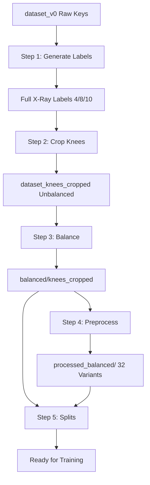

# Data Processing Pipeline

This document covers **Part 1** of the KLGrade pipeline: **Data Preparation**.
It details the end-to-end workflow from raw X-rays to production-ready, balanced, and split datasets.

---

## 1. Quick Reference

Run these scripts in order to generate the full suite of datasets:

```bash
# Step 1: Generate label variants (10/4/8-class)
bash scripts/pipelines/step_1_generate_labels.sh

# Step 2: Crop knee regions
bash scripts/pipelines/step_2_crop_knees.sh

# Step 3: Balance dataset (Oversampling)
bash scripts/pipelines/step_3_balance.sh

# Step 4: Preprocess balanced datasets (Blur, CLAHE, etc.)
bash scripts/pipelines/step_4_preprocess_balanced.sh

# Step 5: Create train/val/test splits
bash scripts/pipelines/step_5_create_splits.sh
```

---

## 2. Detailed Steps

### Step 1: Generate Labels
**Script**: `step_1_generate_labels.sh`
*   **Input**: `datasets/dataset_v0/labels/` (5-class: KL0-4)
*   **Output**: 
    *   `datasets/dataset_v0/labels_10_class/` (Ost/JS sub-grades)
    *   `datasets/dataset_v0/labels_4_class/` (KL1-4, no KL0)
    *   `datasets/dataset_v0/labels_8_class/` (Sub-grades for 4-class)
*   **Logic**: Parses standard KL grades and supplemental Osteophyte/Joint Space narrowing data to create fine-grained labels.

### Step 2: Knee Cropping
**Script**: `step_2_crop_knees.sh`
*   **Input**: Full X-Ray images + Knee bounding boxes (`labels-knee`)
*   **Output**: `datasets/dataset_knees_cropped/`
*   **Logic**:
    *   Crops each knee with a 15% margin.
    *   Automatically expands crop regions to ensure all pathology labels are contained.
    *   Transfers all label variants (5/4/8/10-class) to the new cropped coordinates.

### Step 3: Balancing (Oversampling)
**Script**: `step_3_balance.sh`
*   **Input**: `datasets/dataset_knees_cropped/` (Unbalanced)
*   **Output**: `datasets/balanced/knees_cropped/`
*   **Logic**:
    *   Analyzes class distribution.
    *   Calculates target samples (e.g., ~500-1000 per class).
    *   Applies **horizontal/vertical flips** to minority classes.
    *   Updates labels and bounding boxes for flipped images.
    *    balances BOTH Cropped and Full X-Ray datasets.

### Step 4: Preprocessing Variants
**Script**: `step_4_preprocess_balanced.sh`
*   **Input**: Balanced datasets
*   **Output**: `datasets/processed_balanced/`
*   **Variants Created**:
    1.  `resize_only`: No augmentation (Baseline).
    2.  `blur_clahe2`: Gaussian Blur + CLAHE (Limit 2).
    3.  `sharp_clahe4`: Sharpening + CLAHE (Limit 4).
    4.  `blur_clahe2_notebook`: Legacy variant.
*   **Purpose**: Used for ablation studies to determine optimal image conditioning.

### Step 5: Create Splits
**Script**: `step_5_create_splits.sh`
*   **Input**: All detected datasets in `datasets/`
*   **Output**: `datasets/splits/`
*   **Logic**:
    *   Generates **stratified** Train (70%) / Val (15%) / Test (15%) splits.
    *   Ensures consistent class distribution across splits.
    *   Creates splits for *every* variant (Base, Balanced, Preprocessed × 4/5/8/10 Class).

---

## 3. Pipeline Flowchart



---

## 4. Final Data Structure

After running the full pipeline, your `datasets/` folder will look like this:

```
datasets/
  ├── dataset_v0/                  # Original Full X-rays
  ├── dataset_knees_cropped*/      # Base Cropped (Unbalanced)
  │
  ├── balanced/                    # Balanced Datasets (Recommended for Train)
  │   ├── knees_cropped/
  │   └── full_xray/
  │
  ├── processed_balanced/          # Preprocessed Variants (Optional)
  │   ├── knees_cropped/...
  │   └── full_xray/...
  │
  └── splits/                      # Split Files (.txt)
      ├── dataset_knees_cropped/
      ├── balanced_knees_cropped/
      └── ...
```

---

## 5. Next Steps

Once the pipeline is complete, proceed to **Part 2: Training & Evaluation**.

*   See [DATASETS.md](DATASETS.md) for details on how to load these datasets.
*   See [TRAINING.md](TRAINING.md) for training instructions.
